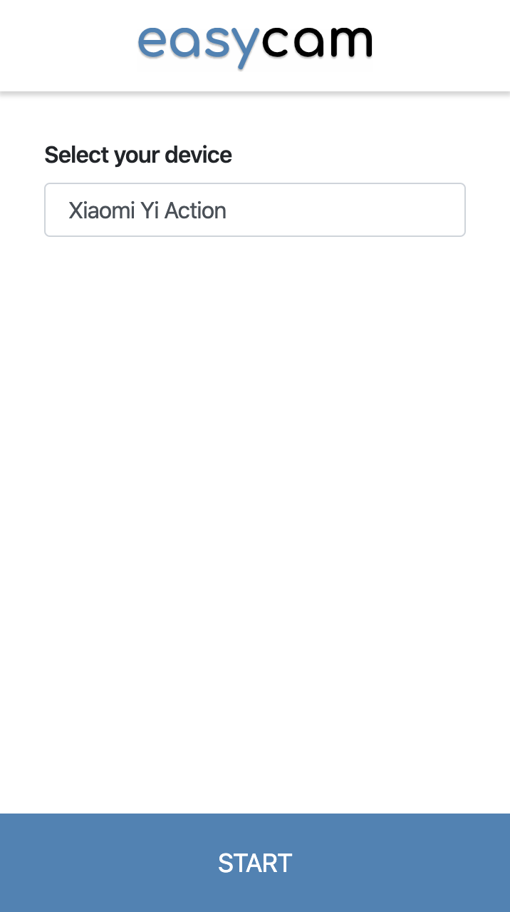
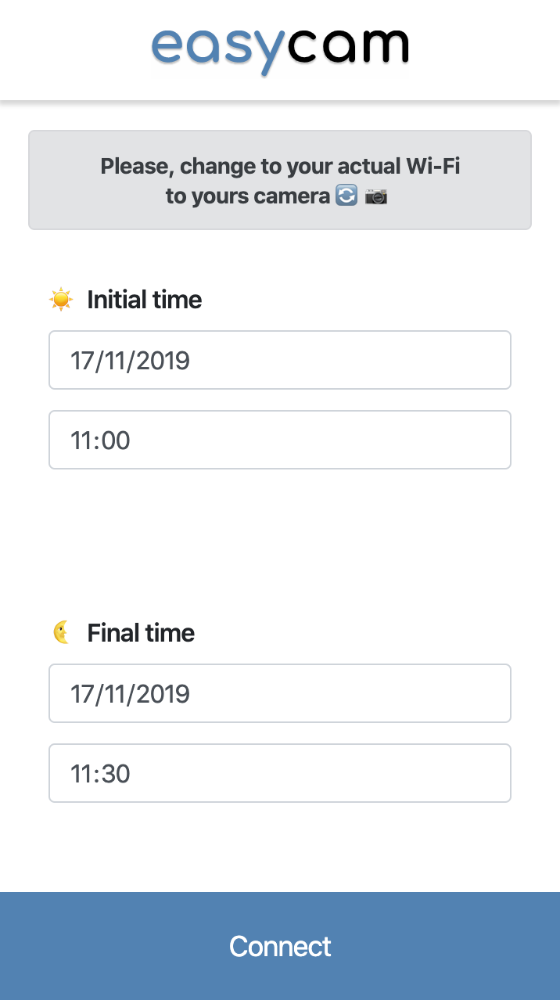
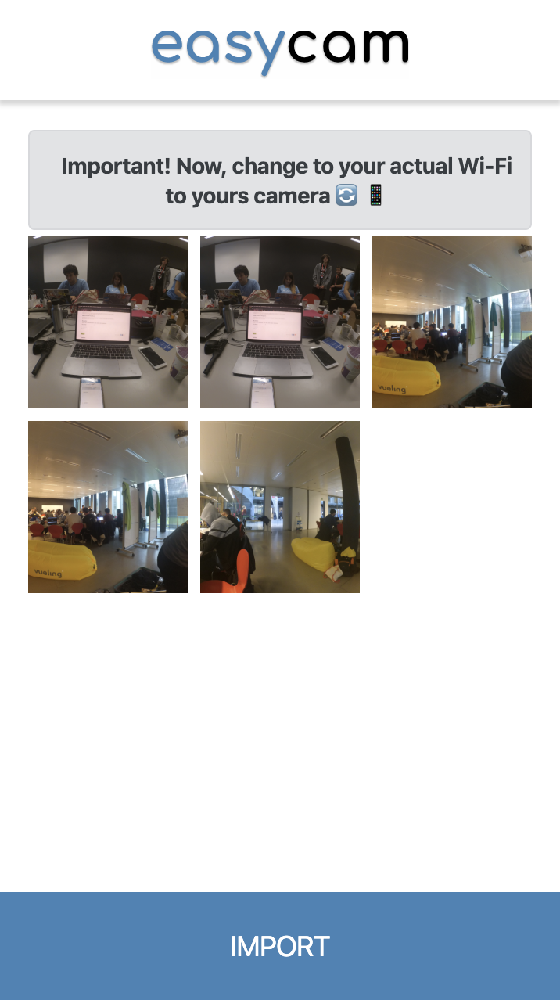
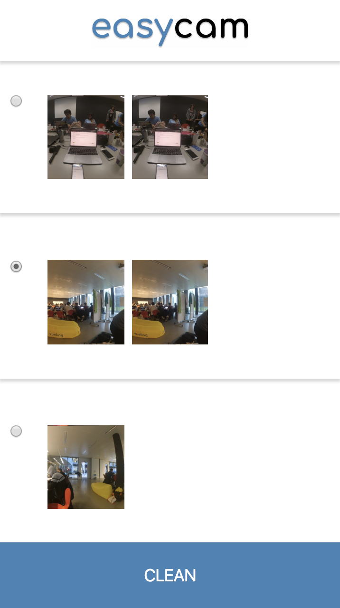
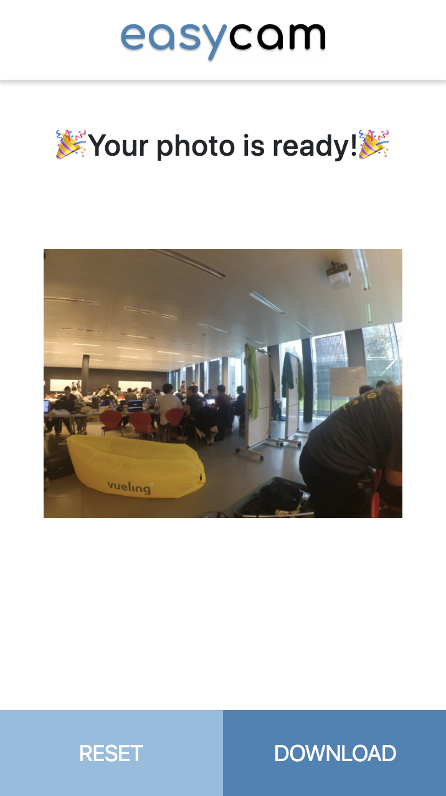

<br>
<p align="center">
  
</p>
<br>

[](http://hits.dwyl.io/elena20ruiz/easycam)
[](https://GitHub.com/elena20ruiz/easycam/stargazers/)
[](https://GitHub.com/elena20ruiz/easycam/network/)
[](https://github.com/elena20ruiz/easycam)
[](https://GitHub.com/elena20ruiz/easycam/graphs/contributors/)
[](https://github.com/elena20ruiz/easycam/blob/master/LICENSE)

[Demo](http://134.209.244.212:8087) | [API Documentation](http://134.209.244.212:8086/ui) | [Devpost](https://devpost.com/software/easycam)

📸 Share your images to Social Media from your DSLR camera without cables and in less than 1 minute. Project built in [LauzHack 2019](https://lauzhack.com/).

## Contents

- [Contents](#contents)
- [Summary](#summary)
  - [Inspiration](#inspiration)
  - [What it does](#what-it-does)
  - [How we built it](#how-we-built-it)
  - [Challenges we ran into](#challenges-we-ran-into)
  - [Accomplishments that we're proud of](#accomplishments-that-were-proud-of)
  - [What we learned](#what-we-learned)
  - [What's next for EasyCam](#whats-next-for-easycam)
- [Screenshots](#screenshots)
- [Requirements](#requirements)
- [Usage](#usage)
- [Authors](#authors)
- [License](#license)

## Summary

### Inspiration

The inspiration came really from a moment where we needed to share photos and videos from our [DSLR](https://en.wikipedia.org/wiki/Digital_single-lens_reflex_camera) in a quick way while we were taking photos in some of the events that we are organizing. We realized that there's a huge bottleneck from the moment that you take a photo and that photo ends to any Social Media.

### What it does

Given a DSLR camera - we decided to play with a [Yi Action Camera](https://www.yitechnology.com/yi-action-camera) (from Xiaomi) - the user goes to the built web application and selects the time frame that they want. The application imports all the media from that time frame and shows all the photos taken during that time.

In order to optimize the selection process, the application splits all the photos by similarity using Machine Learning and then the user selects a cluster. Given that cluster, the application selects the best quality image.

And then, in less than one minute, you have the photo ready to be shared!

### How we built it

Frontend and backend are very different components connected by API requests and deployed with [Docker compose](https://docs.docker.com/compose/).

At the frontend, we can see an [Express Node.JS](https://docs.docker.com/compose/) application built with [JavaScript](https://www.javascript.com/). [Bootstrap](https://getbootstrap.com/), [JQuery](https://jquery.com/), and [EJS](https://ejs.co/) are some of the most important used libraries in order to achieve the frontend.

On the other side of the application, we have the backend which is implemented with [Python 3.7](https://www.python.org/downloads/release/python-370/). For creating the API that allows the communication between the two components, we have used [Flask](https://www.palletsprojects.com/p/flask/) and [OpenAPI](https://swagger.io/specification/) (connected themselves with [Connexion](https://github.com/zalando/connexion) library), integrated with [Docker compose](https://docs.docker.com/compose/). This API is hosted using [uWSGI](https://uwsgi-docs.readthedocs.io/en/latest/) and [Nginx](https://www.nginx.com/) in a small [DigitalOcean](https://www.digitalocean.com/) droplet.

In order to achieve the clustering, we used [Keras](https://keras.io/) with the pre-trained model [Resnet50](https://www.mathworks.com/help/deeplearning/ref/resnet50.html) with the [ImageNet](http://www.image-net.org/) weights in order to retrieve the features of the DSLR camera images. Given that the array of features, we used [nmslib](https://github.com/nmslib/nmslib) in order to create a 2048-dimensional space for computing distances between images. Given that space, we implemented an algorithm for creating the clusters.

Regarding the selection process, we used [OpenCV](https://opencv.org/) in order to retrieve the blurry index for checking what image has the best quality given a cluster.

And last but not least, for the camera connection, we used an Open Source NodeJS project called [yi-action-camera](https://github.com/mariomka/yi-action-camera) and we have added some new features for achieving the goal of the project.

### Challenges we ran into

The most important challenge that we had was when we realized at midnight (12 hours left) that [React](https://reactjs.org/) was not compatible with the needed technology of the yi-action-camera library. We have had to run, a lot, in order to implement an alternative. 0 hours slept was the result at the end.

Also, none of us had experience with Keras so we had to spend some time researching and understanding this Machine Learning framework.

And finally, our experience with Express was very poor. So we have had to refresh our JS knowledge of this framework.

### Accomplishments that we're proud of

Given the fact that we were only two in the team, we are really proud of the result which is a working prototype of our idea!

### What we learned

We have learned how beautiful can be to be able to solve a problem with your own hands in just a weekend. A problem that we know one month ago while the hackathon of our university ([HackUPC](https://hackupc.com/)) was happening.

### What's next for EasyCam

Our first goal was to implement connection with a [Canon camera](https://developers.canon-europe.com/s/) - each member of the team has one. However, we realized that there's no SDK or API or library compatible with our cameras, yet. It would be really cool in a (near) future to add our cameras for using it in the next event.

## Screenshots

This is how our project looks like unifying frontend and backend

<p align="center">
  
</p>

<p align="center">
  
</p>

<p align="center">
  
</p>

<p align="center">
  
</p>

<p align="center">
  
</p>

## Requirements

1. docker-compose

## Usage

To run the whole stack, please execute the following from the root directory:

1. Run the server as a docker container with docker-compose

    ```bash
    docker-compose up -d --build
    ```

## Authors

- [Elena Ruiz](https://github.com/elena20ruiz)
- [Albert Suàrez](https://github.com/AlbertSuarez)

## License

MIT © EasyCam